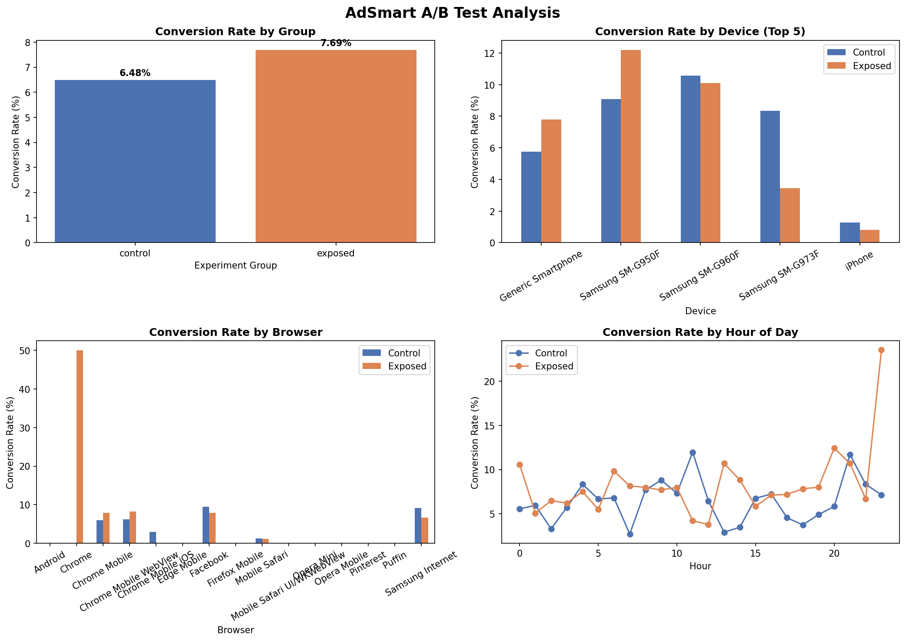

# AdSmart Ad Effectiveness A/B Test

**Does ad exposure actually drive conversions — or is the lift just noise?**

This experiment analyzes a digital advertising A/B test to determine whether users exposed to an ad campaign converted at a statistically significantly higher rate than a control group. The analysis covers hypothesis testing, conversion rate measurement, lift calculation, and segment-level breakdowns by device, browser, and hour to surface actionable targeting insights.

---

## Business Question
A digital ad campaign ran across 8,077 users split into two groups:
- **Control** — users who were not shown the ad
- **Exposed** — users who were shown the ad

Did the ad actually work, or did any observed difference happen by chance?

---

## Dataset
- **Source:** AdSmart A/B Testing Dataset (Kaggle)
- **Records:** 8,077 users
- **Key fields:** experiment group, device, browser, hour, yes (converted), no (rejected)

---

## Methodology

### Hypothesis Test — Chi-Square Test of Independence
Since we have two categorical groups (control/exposed) and a binary outcome (converted/not converted), a chi-square test of independence is the appropriate statistical test.

- **H0:** There is no difference in conversion rate between the control and exposed groups
- **H1:** The exposed group has a statistically different conversion rate than the control group
- **Significance level:** α = 0.05

### Lift Calculation
Both absolute and relative lift were calculated to measure practical significance alongside statistical significance.

### Segment Analysis
Conversion rates were broken down by device, browser, and hour of day to identify where the ad drove the strongest and weakest incremental performance.

---

## Results

| Group | Users | Conversions | Conversion Rate |
|-------|-------|-------------|-----------------|
| Control | 4,071 | 264 | 6.48% |
| Exposed | 4,006 | 308 | 7.69% |

- **Absolute lift:** +1.20 percentage points
- **Relative lift:** +18.6%
- **Chi-square statistic:** 4.26
- **P-value:** 0.0389
- **Result:** Statistically significant (p < 0.05) — we reject H0

The ad campaign drove a statistically significant lift in conversion rate. There is less than a 4% probability this result occurred by chance.

---

## Segment Insights

### By Device
| Device | Control | Exposed | Lift |
|--------|---------|---------|------|
| Samsung SM-G950F | 9.09% | 12.20% | +3.10 pts |
| Generic Smartphone | 5.77% | 7.80% | +2.04 pts |
| Samsung SM-G960F | 10.58% | 10.10% | -0.48 pts |
| Samsung SM-G973F | 8.33% | 3.45% | -4.89 pts |
| iPhone | 1.29% | 0.82% | -0.47 pts |

### By Browser
| Browser | Control | Exposed | Lift |
|---------|---------|---------|------|
| Chrome Mobile | 5.98% | 7.93% | +1.95 pts |
| Chrome Mobile WebView | 6.16% | 8.19% | +2.02 pts |
| Samsung Internet | 9.15% | 6.63% | -2.52 pts |
| Facebook | 9.45% | 7.88% | -1.57 pts |
| Mobile Safari | 1.22% | 1.10% | -0.12 pts |

### By Hour
- Hour 23 (11pm) showed the strongest exposed performance (23.5% vs 7.1% control)
- Hours 13 and 20 (1pm and 8pm) also showed strong exposed lift
- Hour 11 (11am) showed strong control performance, suggesting ad fatigue or poor timing

---

## Business Recommendations

1. **Scale the campaign** — statistically significant lift justifies continued investment
2. **Prioritize Samsung SM-G950F** — highest incremental lift of any device (+3.1 pts)
3. **Exclude Samsung SM-G973F** — ad exposure hurt conversion on this device (-4.89 pts)
4. **Concentrate on Chrome Mobile** — most consistent positive lift across mobile browsers
5. **Test late-night scheduling** — hour 23 showed disproportionately high exposed conversion; worth a dedicated time-targeted follow-up experiment

---

## Visualizations


---

## How to Run
```bash
pip install pandas numpy scipy matplotlib seaborn
python adsmart_ab_test.py
```
Make sure the CSV file is in the same directory as the script.

---

## Tech Stack
Python, pandas, numpy, scipy, matplotlib, seaborn
